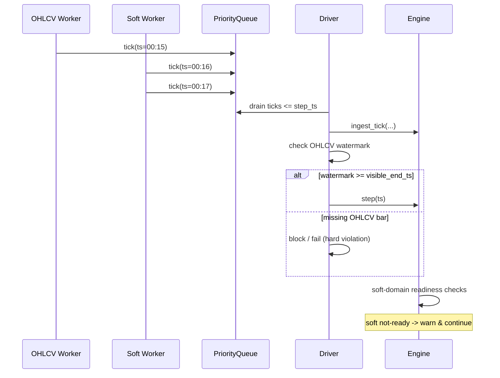

# Ingestion Boundary and Readiness

This document describes the boundary between ingestion and runtime, and the readiness rules
that govern whether a step is legal or degraded. It is a design reference for async ingestion.

## External ingestion boundary
SoionLab separates data ingestion from the runtime. Ingestion is an external subsystem responsible for:
- fetching, listening to, or replaying data
- normalizing raw inputs into immutable ticks
- optionally persisting data (e.g., parquet)

The runtime never interacts with data sources. It only consumes normalized ticks provided by the Driver.

**Hard boundary (single entry point):**
```
WORLD -> Ingestion -> Tick -> Driver -> Engine -> DataHandler -> Feature/Model
```

Key constraints:
- Ingestion may be synchronous or asynchronous and may block on I/O.
- The runtime is single-threaded and strictly driver-time controlled.
- Strategy/Engine/DataHandler never know data provenance.
- The only object crossing the boundary is an immutable `IngestionTick`.

## Async tick arrival and replay
SoionLab uses the same async ingestion -> tick -> driver -> engine pipeline for backtest,
mock, and realtime. Because ingestion is concurrent, tick arrival order does not guarantee
domain-level readiness at a given step timestamp. Backtest runs faster and exposes this
more often, but the issue exists in all modes.

## Hard readiness vs soft degradation
### Hard (grid-based domains, e.g., OHLCV)
Bars must be closed before they are visible.
```
visible_end_ts(ts) = floor(ts / interval_ms) * interval_ms - 1
```
A step at `ts` is legal only if:
```
handler.last_timestamp() >= visible_end_ts(ts)
```
The Driver uses handler watermarks (last tick timestamps) to enforce this rule.
Violation is treated as a hard failure and indicates missing or inconsistent market data.

This prevents:
- lookahead bias
- race-driven nondeterminism
- scheduling-dependent one-bar lag

### Soft (non-grid domains: option_chain, iv_surface, sentiment, orderbook, ...)
No closed-bar semantics apply. Soft domains are checked inside `engine.step(ts)`:
- a snapshot exists with `data_ts <= ts`
- freshness/coverage constraints (domain-specific)

If not ready:
- the step still executes
- a warning is logged (`soft_domain.not_ready`)
- no blocking, no exception

## Design trade-off
SoionLab enforces one execution logic across backtest, mock, and realtime. This sacrifices
a small amount of backtest determinism for soft domains, but makes data gaps explicit and
auditable across modes.


