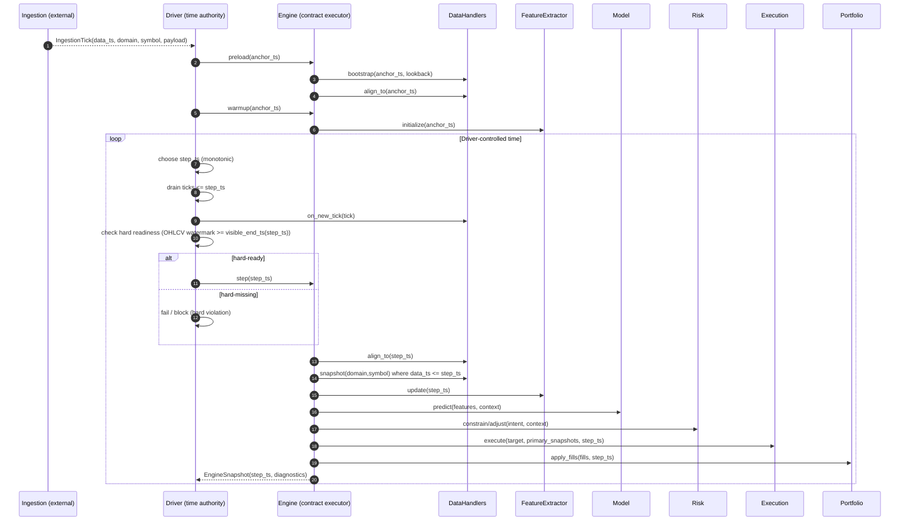

# Runtime Semantics

This document summarizes runtime timing rules and legality checks. It focuses on the
single time authority model and the minimal flow required to reproduce step semantics
across modes.

## Driver-owned time (single time authority)
The Driver is the single time authority. The Engine is time-agnostic but time-validated.

## Step monotonicity and legality checks
SoionLab enforces a strict single-owner time model. Only the Driver (BacktestEngine, MockEngine,
RealtimeEngine) may choose when time advances, what timestamp is processed next, and how replay
is paced. The engine rejects non-monotonic step timestamps and visible lookahead states.

| Layer | Owns time progression? | Responsibility |
| --- | --- | --- |
| Strategy | No | Declare structure and intent only |
| Feature | No (accepts `ts` only) | Snapshot/windowed computation |
| DataHandler | No (`on_new_tick` / `align_to` only) | Cache + anti-lookahead gates |
| StrategyEngine | No (relays `ts` only) | Runtime orchestration |
| Driver / Runner | Yes | Single time authority |

Why it matters:
- Strategies never pull data.
- Features never advance time.
- DataHandlers never decide when new data arrives.
- The Engine never infers or advances timestamps.

Every timestamp used for feature computation, model prediction, risk sizing, and execution
originates from the Driver. This isolates time ownership and makes lookahead errors visible
as contract violations rather than modeling bugs.

## Runtime flow
At runtime, each step executes a contract-driven pipeline:
1. DataHandlers expose market snapshots (`data_ts <= step_ts`).
2. Features update on `step_ts` and emit a feature dict.
3. Models produce scores.
4. Decision + Risk transform scores into a target position.
5. Execution produces fills (same semantics across backtest/mock/realtime).
6. Portfolio applies fills and records state.
